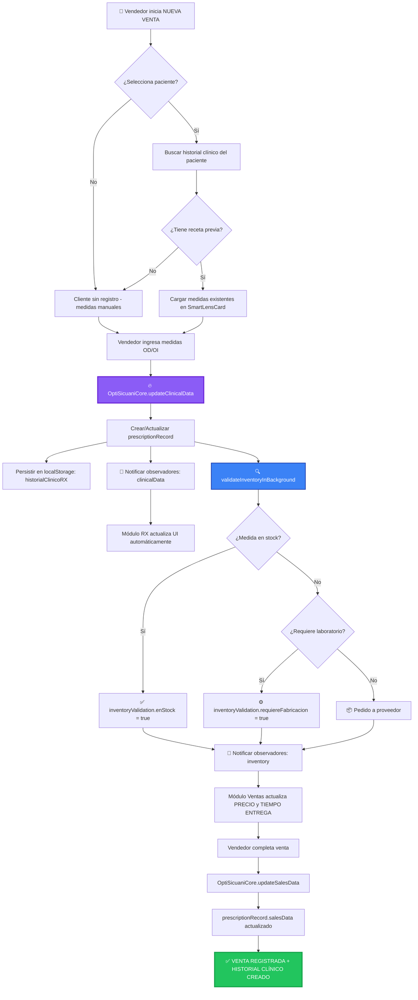
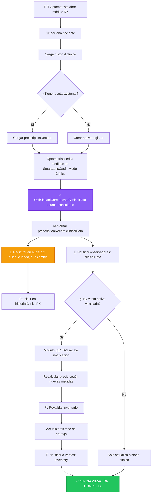
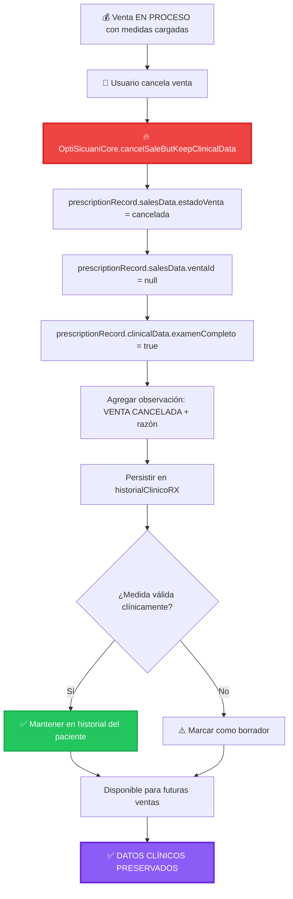

# ARQUITECTURA ENTERPRISE V6.0 - CENTRO ÓPTICO SICUANI
## Sistema de Sincronización Bidireccional Ventas ⟷ RX

---

## ÍNDICE

1. [Introducción](#introducción)
2. [Diagrama de Flujo de Datos](#diagrama-de-flujo-de-datos)
3. [Estructura de Componentes (Frontend)](#estructura-de-componentes-frontend)
4. [Lógica de Negocio - Casos de Borde](#lógica-de-negocio---casos-de-borde)
5. [API del Core State Manager](#api-del-core-state-manager)
6. [Guía de Implementación](#guía-de-implementación)

---

## INTRODUCCIÓN

Esta arquitectura implementa un **sistema de gestión de estado unificado** que elimina la segregación entre los módulos de **Ventas (POS)** y **RX (Medidas Clínicas/Consultorio)**.

### Objetivo Principal
Fusionar ambos módulos en una **entidad de datos fluida y bidireccional**, donde:
- ✅ La **receta/medida** es la fuente única de verdad (Single Source of Truth)
- ✅ Cambios en Ventas actualizan automáticamente el historial clínico
- ✅ Cambios en RX refactoricen precio/disponibilidad en Ventas
- ✅ Validación de inventario en background (stock vs laboratorio)
- ✅ Persistencia clínica independiente de transacciones comerciales

---

## DIAGRAMA DE FLUJO DE DATOS

### 1️⃣ FLUJO: Vendedor Carga Medidas en Nueva Venta



### 2️⃣ FLUJO: Optometrista Actualiza Medida desde Consultorio



### 3️⃣ FLUJO: Caso de Borde - Cancelación de Venta



---

## ESTRUCTURA DE COMPONENTES (FRONTEND)

### Patrón Container/Presenter

```javascript
// ═══════════════════════════════════════════════════════════════════
// COMPONENTE: SmartLensCard (Container)
// Responsabilidad: Lógica de negocio y gestión de estado
// ═══════════════════════════════════════════════════════════════════

class SmartLensCardContainer {
  constructor(patientId, recordId = null) {
    this.patientId = patientId;
    this.recordId = recordId;
    this.viewMode = 'vendor'; // 'vendor' | 'clinical'

    // Suscribirse a cambios del Core
    OptiSicuaniCore.subscribe('clinicalData', this.onClinicalDataChange.bind(this));
    OptiSicuaniCore.subscribe('inventory', this.onInventoryChange.bind(this));

    // Cargar o crear registro
    if (recordId) {
      OptiSicuaniCore.loadRecord(recordId);
    } else {
      this.recordId = OptiSicuaniCore.createNewRecord(patientId, usuarioActual);
    }

    this.render();
  }

  // ═══ GESTIÓN DE EVENTOS ═══

  onClinicalDataChange(data) {
    console.log('📝 Medidas actualizadas:', data);
    this.updateVendorView(data.record.clinicalData);
    this.updateClinicalView(data.record.clinicalData);
    this.updateAuditLog(data.changes);
  }

  onInventoryChange(data) {
    console.log('🔍 Inventario validado:', data.validation);
    this.updateDeliveryInfo(data.validation);
    this.updatePricing(data.validation);
  }

  // ═══ CAMBIO DE MODO DE VISUALIZACIÓN ═══

  toggleViewMode(newMode) {
    this.viewMode = newMode;
    const card = document.querySelector('.smart-lens-card');
    card.setAttribute('data-view-mode', newMode);

    // Actualizar botones del toggle
    document.querySelectorAll('.view-mode-btn').forEach(btn => {
      btn.classList.toggle('active', btn.dataset.mode === newMode);
    });
  }

  // ═══ EDICIÓN DE MEDIDAS (desde cualquier modo) ═══

  onMedidaChange(ojo, campo, valor) {
    const currentState = OptiSicuaniCore.getState();
    const updatedData = {
      ...currentState.clinicalData,
      [ojo]: {
        ...currentState.clinicalData[ojo],
        [campo]: valor
      }
    };

    // Actualizar con validación
    if (this.validateMedida(ojo, campo, valor)) {
      OptiSicuaniCore.updateClinicalData(
        updatedData,
        this.viewMode === 'clinical' ? 'consultorio' : 'ventas',
        { usuario: usuarioActual, patientId: this.patientId }
      );

      this.showSyncIndicator('syncing');
      setTimeout(() => this.showSyncIndicator('synced'), 500);
    } else {
      this.showValidationError(ojo, campo, 'Valor inválido para ' + campo);
    }
  }

  validateMedida(ojo, campo, valor) {
    // Validaciones según campo
    if (campo === 'eje' && (valor < 0 || valor > 180)) return false;
    if (campo === 'dp' && (valor < 40 || valor > 80)) return false;
    // ... más validaciones
    return true;
  }

  // ═══ ACTUALIZACIÓN DE UI ═══

  updateVendorView(clinicalData) {
    // Actualizar vista simplificada para vendedor
    document.querySelector('.vendor-rx-values.od').textContent =
      `${clinicalData.od.esfera} / ${clinicalData.od.cilindro} x ${clinicalData.od.eje}`;

    document.querySelector('.vendor-rx-values.oi').textContent =
      `${clinicalData.oi.esfera} / ${clinicalData.oi.cilindro} x ${clinicalData.oi.eje}`;

    // Actualizar visualización gráfica de espesor
    this.updateLensThicknessVisual(clinicalData);
  }

  updateClinicalView(clinicalData) {
    // Actualizar inputs técnicos
    ['esfera', 'cilindro', 'eje', 'adicion', 'dp', 'altura'].forEach(campo => {
      document.querySelector(`#clinical-od-${campo}`).value = clinicalData.od[campo];
      document.querySelector(`#clinical-oi-${campo}`).value = clinicalData.oi[campo];
    });
  }

  updateDeliveryInfo(validation) {
    const deliveryTimeEl = document.querySelector('.delivery-time');
    const deliveryStatusEl = document.querySelector('.delivery-status');

    deliveryTimeEl.textContent = `${validation.tiempoEntregaEstimado} días`;

    if (validation.enStock) {
      deliveryStatusEl.textContent = '✅ Disponible en stock';
      deliveryStatusEl.style.color = 'var(--success-700)';
    } else if (validation.requiereFabricacion) {
      deliveryStatusEl.textContent = '⚙️ Requiere fabricación en laboratorio';
      deliveryStatusEl.style.color = 'var(--warning-700)';
    } else {
      deliveryStatusEl.textContent = '📦 Pedido a proveedor';
      deliveryStatusEl.style.color = 'var(--secondary-700)';
    }
  }

  updateAuditLog(changes) {
    const logContainer = document.querySelector('.clinical-audit-log');

    changes.forEach(change => {
      const entry = document.createElement('div');
      entry.className = 'audit-log-entry';
      entry.innerHTML = `
        <div class="audit-log-entry-header">
          <span class="audit-log-user">${change.usuario}</span>
          <span class="audit-log-time">${new Date(change.timestamp).toLocaleString()}</span>
        </div>
        <div class="audit-log-change">
          <strong>${change.campo}</strong>:
          <span style="text-decoration: line-through; color: var(--error-500);">${change.anterior}</span>
          →
          <span style="color: var(--success-600); font-weight: 700;">${change.nuevo}</span>
        </div>
      `;
      logContainer.prepend(entry);
    });
  }

  showSyncIndicator(status) {
    const indicator = document.querySelector('.sync-indicator');
    indicator.classList.toggle('syncing', status === 'syncing');
    indicator.querySelector('span').textContent =
      status === 'syncing' ? 'Sincronizando...' : 'Sincronizado ✓';
  }

  // ═══ RENDERIZADO INICIAL ═══

  render() {
    const container = document.getElementById('smart-lens-card-container');
    container.innerHTML = `
      <div class="smart-lens-card" data-view-mode="${this.viewMode}">
        <!-- Indicador de sincronización -->
        <div class="sync-indicator">
          <div class="sync-indicator-dot"></div>
          <span>Sincronizado ✓</span>
        </div>

        <!-- Cabecera con toggle -->
        <div class="smart-lens-card-header">
          <div class="smart-lens-card-title">
            <span class="smart-lens-card-title-icon">👓</span>
            <span>Medidas Clínicas / RX</span>
          </div>

          <div class="view-mode-toggle">
            <button class="view-mode-btn active" data-mode="vendor" onclick="smartCard.toggleViewMode('vendor')">
              <span>🛒</span> Modo Vendedor
            </button>
            <button class="view-mode-btn" data-mode="clinical" onclick="smartCard.toggleViewMode('clinical')">
              <span>🔬</span> Modo Clínico
            </button>
          </div>
        </div>

        <!-- VISTA VENDEDOR -->
        <div class="vendor-view-content">
          ${this.renderVendorView()}
        </div>

        <!-- VISTA CLÍNICA -->
        <div class="clinical-view-content">
          ${this.renderClinicalView()}
        </div>
      </div>
    `;
  }

  renderVendorView() {
    return `
      <div class="vendor-rx-summary">
        <!-- OJO DERECHO -->
        <div class="vendor-eye-card od">
          <div class="vendor-eye-label">👁️ OJO DERECHO (OD)</div>
          <div class="vendor-rx-values od">+2.00 / -0.75 x 90°</div>
          <span class="vendor-rx-type">📐 Monofocal</span>
        </div>

        <!-- OJO IZQUIERDO -->
        <div class="vendor-eye-card">
          <div class="vendor-eye-label">👁️ OJO IZQUIERDO (OI)</div>
          <div class="vendor-rx-values oi">+1.75 / -0.50 x 85°</div>
          <span class="vendor-rx-type">📐 Monofocal</span>
        </div>
      </div>

      <!-- Visualización gráfica de espesor -->
      <div class="lens-thickness-visual">
        <div class="lens-thickness-label">Espesor aproximado de luna</div>
        <div class="lens-visual-container">
          <div class="lens-shape">CR39</div>
          <div class="lens-info">
            <div class="lens-info-item">
              <span class="lens-info-label">Material:</span>
              <span class="lens-info-value">CR-39 Estándar</span>
            </div>
            <div class="lens-info-item">
              <span class="lens-info-label">Índice:</span>
              <span class="lens-info-value">1.56</span>
            </div>
            <div class="lens-info-item">
              <span class="lens-info-label">Espesor centro:</span>
              <span class="lens-info-value">≈ 3.2mm</span>
            </div>
          </div>
        </div>
      </div>

      <!-- Precio y disponibilidad -->
      <div class="vendor-price-section">
        <div class="vendor-price-row">
          <span class="vendor-price-label">Precio Lunas:</span>
          <span class="vendor-price-value">S/ 180.00</span>
        </div>
        <div class="vendor-delivery-info">
          <span class="delivery-icon">🚚</span>
          <div class="delivery-text">
            <div class="delivery-time">Entrega en 3 días</div>
            <div class="delivery-status">📦 Pedido a proveedor</div>
          </div>
        </div>
      </div>
    `;
  }

  renderClinicalView() {
    return `
      <div class="clinical-rx-grid">
        <!-- OJO DERECHO -->
        <div class="clinical-eye-section od">
          <div class="clinical-eye-header">👁️ OJO DERECHO (OD)</div>
          <div class="clinical-input-group">
            <div class="clinical-field">
              <label>Esfera</label>
              <input type="text" id="clinical-od-esfera"
                     onchange="smartCard.onMedidaChange('od', 'esfera', this.value)">
            </div>
            <div class="clinical-field">
              <label>Cilindro</label>
              <input type="text" id="clinical-od-cilindro"
                     onchange="smartCard.onMedidaChange('od', 'cilindro', this.value)">
            </div>
            <div class="clinical-field">
              <label>Eje (0-180°)</label>
              <input type="number" id="clinical-od-eje" min="0" max="180"
                     onchange="smartCard.onMedidaChange('od', 'eje', this.value)">
            </div>
            <div class="clinical-field">
              <label>Adición</label>
              <input type="text" id="clinical-od-adicion"
                     onchange="smartCard.onMedidaChange('od', 'adicion', this.value)">
            </div>
            <div class="clinical-field">
              <label>DP (mm)</label>
              <input type="number" id="clinical-od-dp" min="40" max="80"
                     onchange="smartCard.onMedidaChange('od', 'dp', this.value)">
            </div>
            <div class="clinical-field">
              <label>Altura (mm)</label>
              <input type="number" id="clinical-od-altura"
                     onchange="smartCard.onMedidaChange('od', 'altura', this.value)">
            </div>
          </div>
          <div class="clinical-validation-alert">⚠️ Advertencia: Eje fuera de rango</div>
        </div>

        <!-- OJO IZQUIERDO (estructura idéntica) -->
        <div class="clinical-eye-section oi">
          <div class="clinical-eye-header">👁️ OJO IZQUIERDO (OI)</div>
          <!-- ... campos similares ... -->
        </div>
      </div>

      <!-- Historial de cambios -->
      <div class="clinical-audit-log">
        <div class="audit-log-title">📜 Historial de cambios</div>
        <!-- Las entradas se generan dinámicamente -->
      </div>
    `;
  }
}

// ═══════════════════════════════════════════════════════════════════
// INICIALIZACIÓN EN MÓDULO DE VENTAS
// ═══════════════════════════════════════════════════════════════════

let smartCard = null;

function iniciarNuevaVentaConMedidas(clienteId) {
  // Crear instancia del SmartLensCard
  smartCard = new SmartLensCardContainer(clienteId);

  // El componente ya está suscrito al Core y reaccionará automáticamente
  console.log('✅ SmartLensCard inicializado. Sincronización activa.');
}

// ═══════════════════════════════════════════════════════════════════
// INICIALIZACIÓN EN MÓDULO DE CONSULTORIO (RX)
// ═══════════════════════════════════════════════════════════════════

function abrirHistorialClinico(pacienteId) {
  // Buscar última receta del paciente
  const historial = JSON.parse(localStorage.getItem('historialClinicoRX') || '[]');
  const ultimaReceta = historial
    .filter(r => r.patientId === pacienteId)
    .sort((a, b) => new Date(b.createdAt) - new Date(a.createdAt))[0];

  if (ultimaReceta) {
    smartCard = new SmartLensCardContainer(pacienteId, ultimaReceta.id);
    smartCard.toggleViewMode('clinical'); // Abrir en modo clínico
  } else {
    smartCard = new SmartLensCardContainer(pacienteId);
    smartCard.toggleViewMode('clinical');
  }
}
```

---

## LÓGICA DE NEGOCIO - CASOS DE BORDE

### Caso 1: Venta Cancelada pero Medida Válida

**Escenario:**
Un cliente viene a comprar lentes, el vendedor toma sus medidas, pero el cliente decide no comprar en ese momento.

**Solución Implementada:**
```javascript
// En el módulo de Ventas, botón "Cancelar Venta"
function cancelarVentaActual() {
  const razon = prompt('¿Por qué se cancela la venta?');

  const recordId = OptiSicuaniCore.getState().id;

  // Cancelar venta pero preservar medidas clínicas
  const exito = OptiSicuaniCore.cancelSaleButKeepClinicalData(recordId, razon);

  if (exito) {
    mostrarNotificacion(
      'Venta cancelada. Las medidas se guardaron en el historial clínico del paciente.',
      'info'
    );

    // La próxima vez que este cliente vuelva, sus medidas estarán disponibles
    cerrarVentaActual();
  }
}
```

**Resultado:**
- ✅ `prescriptionRecord.salesData.estadoVenta` = `'cancelada'`
- ✅ `prescriptionRecord.clinicalData` se mantiene intacto
- ✅ El registro aparece en el historial del paciente como "Consulta sin venta"
- ✅ En la próxima venta, el vendedor puede reutilizar estas medidas

---

### Caso 2: Optometrista Actualiza Medida de Venta en Proceso

**Escenario:**
Un cliente está en caja pagando, pero el optometrista detecta un error en las medidas y las corrige.

**Solución Implementada:**
```javascript
// El SmartLensCard escucha cambios automáticamente
OptiSicuaniCore.subscribe('clinicalData', (data) => {
  if (data.source === 'consultorio') {
    // Mostrar alerta en módulo de Ventas
    mostrarAlertaEnVentas(
      `⚠️ ATENCIÓN: Las medidas fueron actualizadas por ${data.record.lastModifiedBy}.
       El precio y tiempo de entrega pueden haber cambiado.`
    );

    // Recalcular precio automáticamente
    recalcularPrecioVenta();
  }
});
```

**Resultado:**
- ✅ Vendedor recibe notificación en tiempo real
- ✅ Precio y disponibilidad se actualizan automáticamente
- ✅ Auditoría completa: quién cambió, qué cambió, cuándo

---

### Caso 3: Cliente Regresa 6 Meses Después

**Escenario:**
Un cliente que compró hace 6 meses regresa para un nuevo pedido. Sus medidas pueden haber cambiado.

**Solución Implementada:**
```javascript
function cargarClienteEnVenta(clienteId) {
  const historial = JSON.parse(localStorage.getItem('historialClinicoRX') || '[]');
  const recetaAnterior = historial
    .filter(r => r.patientId === clienteId && r.salesData.estadoVenta === 'confirmada')
    .sort((a, b) => new Date(b.createdAt) - new Date(a.createdAt))[0];

  if (recetaAnterior) {
    const mesesTranscurridos =
      (Date.now() - new Date(recetaAnterior.fechaExamen)) / (1000 * 60 * 60 * 24 * 30);

    if (mesesTranscurridos > 6) {
      mostrarAdvertencia(
        `⚠️ La última receta tiene ${Math.round(mesesTranscurridos)} meses.
         Se recomienda un nuevo examen optométrico.`,
        'warning'
      );
    } else {
      // Cargar medidas anteriores como sugerencia
      OptiSicuaniCore.loadRecord(recetaAnterior.id);
      smartCard.render();
    }
  }
}
```

**Resultado:**
- ✅ Historial clínico completo disponible
- ✅ Alertas automáticas si la receta es antigua
- ✅ Opción de reutilizar o crear nueva medida

---

## API DEL CORE STATE MANAGER

### Métodos Públicos

#### `OptiSicuaniCore.createNewRecord(patientId, usuario)`
Crea un nuevo registro de receta/medida vacío.

**Parámetros:**
- `patientId` (string): ID del paciente
- `usuario` (string): Nombre del usuario que crea el registro

**Retorna:** `string` - ID único del registro creado

---

#### `OptiSicuaniCore.updateClinicalData(clinicalData, source, metadata)`
Actualiza las medidas clínicas y dispara sincronización.

**Parámetros:**
- `clinicalData` (object): Objeto con medidas OD/OI
- `source` (string): `'ventas'` o `'consultorio'`
- `metadata` (object): `{ usuario, patientId }`

**Retorna:** `string` - ID del registro actualizado

**Efectos:**
- ✅ Actualiza `prescriptionRecord.clinicalData`
- ✅ Registra cambios en `auditLog`
- ✅ Notifica a observadores `'clinicalData'`
- ✅ Dispara validación de inventario en background

---

#### `OptiSicuaniCore.updateSalesData(salesData, metadata)`
Actualiza datos comerciales de la venta.

**Parámetros:**
- `salesData` (object): `{ ventaId, precioLunas, precioTotal, fechaEntrega, ... }`
- `metadata` (object): Metadatos adicionales

**Retorna:** `string` - ID del registro actualizado

**Efectos:**
- ✅ Actualiza `prescriptionRecord.salesData`
- ✅ Notifica a observadores `'salesData'`

---

#### `OptiSicuaniCore.cancelSaleButKeepClinicalData(recordId, razon)`
Cancela la venta pero preserva los datos clínicos.

**Parámetros:**
- `recordId` (string): ID del registro
- `razon` (string): Motivo de la cancelación

**Retorna:** `boolean` - `true` si se canceló correctamente

**Efectos:**
- ✅ Marca venta como cancelada
- ✅ Preserva medidas clínicas en historial
- ✅ Agrega observación explicativa

---

#### `OptiSicuaniCore.subscribe(type, callback)`
Registra un observador para recibir notificaciones de cambios.

**Parámetros:**
- `type` (string): `'clinicalData'`, `'salesData'`, o `'inventory'`
- `callback` (function): Función a ejecutar cuando haya cambios

**Ejemplo:**
```javascript
OptiSicuaniCore.subscribe('clinicalData', (data) => {
  console.log('Medidas actualizadas:', data.record);
  console.log('Cambios realizados:', data.changes);
  console.log('Origen:', data.source); // 'ventas' o 'consultorio'
});
```

---

#### `OptiSicuaniCore.getState()`
Obtiene el estado actual del registro activo (solo lectura).

**Retorna:** `object` - Copia del `prescriptionRecord` actual

---

#### `OptiSicuaniCore.loadRecord(recordId)`
Carga un registro existente desde localStorage.

**Parámetros:**
- `recordId` (string): ID del registro a cargar

**Retorna:** `boolean` - `true` si se cargó correctamente

---

## GUÍA DE IMPLEMENTACIÓN

### Paso 1: Verificar que el Core esté cargado

Al abrir la página, verifica en la consola:
```
🚀 OptiSicuaniCore inicializado correctamente
📊 Estado global disponible. Sincronización bidireccional activa.
```

---

### Paso 2: Integrar SmartLensCard en Módulo de Ventas

Localiza la función de "Nueva Venta" y reemplaza el formulario de medidas por:

```javascript
function iniciarNuevaVenta() {
  // ... código existente ...

  // AGREGAR: Inicializar SmartLensCard
  const clienteId = document.getElementById('clienteSeleccionado').value;
  smartCard = new SmartLensCardContainer(clienteId);

  // El componente se renderiza automáticamente en:
  document.getElementById('smart-lens-card-container').style.display = 'block';
}
```

---

### Paso 3: Integrar en Módulo de Consultorio (RX)

```javascript
function abrirExamenPaciente(pacienteId) {
  // ... código existente ...

  // AGREGAR: Abrir SmartLensCard en modo clínico
  smartCard = new SmartLensCardContainer(pacienteId);
  smartCard.toggleViewMode('clinical');
}
```

---

### Paso 4: Conectar Validación de Inventario

Actualmente la validación es simulada. Conéctala con tu sistema real:

```javascript
// En Revision0008.html, líneas 395-398, reemplazar:
function hayStockDisponible(clinicalData) {
  // TODO: Conectar con inventario real
  // IMPLEMENTAR AQUÍ:
  const lunas = obtenerInventarioLunas(); // Tu función existente

  // Buscar si existe luna con esa medida exacta
  const match = lunas.find(luna =>
    Math.abs(luna.esfera - parseFloat(clinicalData.od.esfera)) < 0.25 &&
    Math.abs(luna.cilindro - parseFloat(clinicalData.od.cilindro)) < 0.25
  );

  return match && match.stock > 0;
}
```

---

### Paso 5: Probar la Sincronización

1. **Abrir módulo de Ventas**
2. **Iniciar nueva venta** y cargar medidas
3. **Sin finalizar la venta**, abrir el módulo de **Consultorio/RX** en otra pestaña
4. **Modificar una medida** (ej: cambiar esfera de +2.00 a +2.25)
5. **Volver al módulo de Ventas** → Debe mostrarse una notificación de cambio
6. **Verificar** que el precio y tiempo de entrega se actualizaron

---

## CONCLUSIÓN

Esta arquitectura implementa:

✅ **Single Source of Truth**: La receta es la entidad central
✅ **Sincronización Bidireccional**: Ventas ⟷ RX en tiempo real
✅ **Patrón Observer**: Cambios se propagan automáticamente
✅ **Validación Inteligente**: Inventario consultado en background
✅ **Persistencia Clínica**: Datos médicos independientes de transacciones
✅ **Auditoría Completa**: Historial de quién/cuándo/qué cambió
✅ **UX Dual**: Vista simplificada (vendedor) y técnica (clínico)

---

## STACK TECNOLÓGICO

- **Frontend:** JavaScript Vanilla (ES6+)
- **State Management:** Patrón Observer + IIFE Module
- **Persistencia:** LocalStorage (migrable a IndexedDB o Backend)
- **UI Pattern:** Container/Presenter (separación lógica/presentación)
- **CSS:** Variables CSS + Animaciones nativas

---

## PRÓXIMOS PASOS (OPCIONAL)

1. **Backend Integration**: Migrar de localStorage a API REST
2. **WebSockets**: Sincronización en tiempo real entre múltiples terminales
3. **PWA**: Soporte offline con sincronización al reconectar
4. **Impresión**: Generar PDF de receta con logo y firma digital
5. **Analytics**: Dashboard de métricas (RX más frecuentes, tiempos de entrega)

---

**Desarrollado por:** Centro Óptico Sicuani
**Versión:** 6.0 Enterprise
**Fecha:** Enero 2026
**Arquitectura inspirada en:** Luxottica, Essilor, Visual Center
