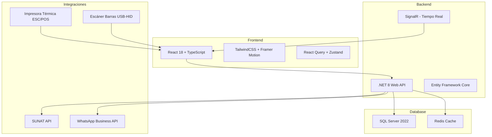
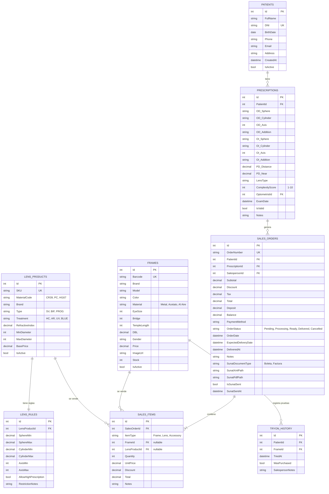
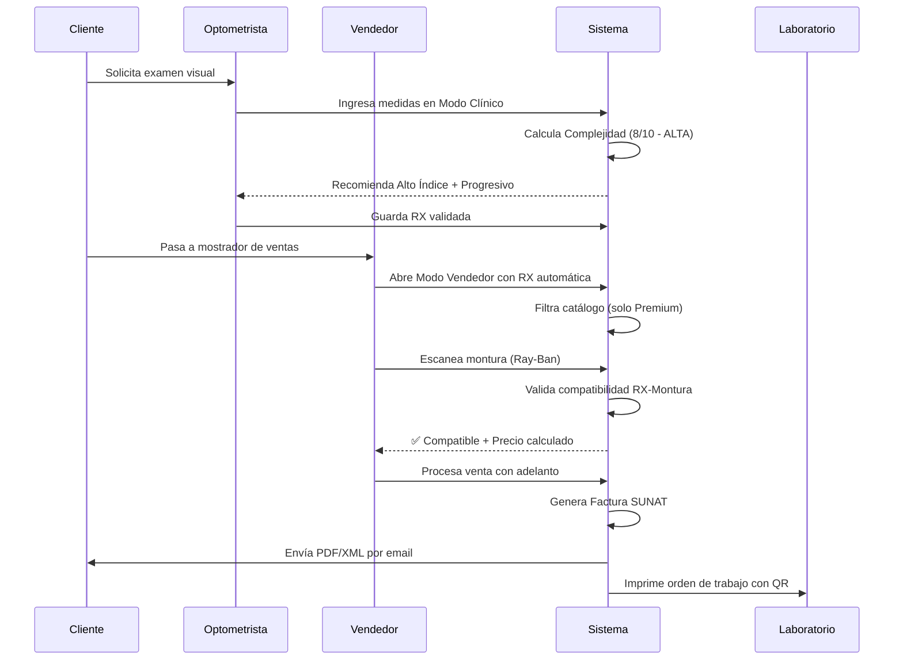

# 🏛️ ARQUITECTURA LUXOTTICA KILLER - CENTRO ÓPTICO SICUANI
## Sistema Enterprise de Próxima Generación

---

## 🎯 VISIÓN GENERAL

Un sistema que **supera** a Luxottica, Essilor y GMO combinando:
- ✅ **Validación Paramétrica** inteligente de lunas
- ✅ **Sincronización en Tiempo Real** Ventas ⟷ RX
- ✅ **IA Predictiva** para recomendaciones
- ✅ **Integración Total** Hardware + Software
- ✅ **Facturación Electrónica** SUNAT automatizada
- ✅ **UX Nivel Apple** que impresiona al cliente

---

## 📊 STACK TECNOLÓGICO PROPUESTO



---

## 🗄️ MODELO DE DATOS - ESTRUCTURA BASE

### ENTIDADES PRINCIPALES (Esperando tus respuestas para detalles)



---

## 🎨 UI/UX VANGUARDISTA - WIREFRAMES CONCEPTUALES

### 1. LENS ENGINE - Visualizador de Espesores

```
╔════════════════════════════════════════════════════════════════╗
║  🔬 SIMULADOR DE ESPESOR - COMPARACIÓN INTELIGENTE            ║
╠════════════════════════════════════════════════════════════════╣
║                                                                ║
║  RX: OD -8.00 / -2.00 x 90°  |  Montura: Ray-Ban 52mm        ║
║                                                                ║
║  ┌─────────────────────┐  ┌─────────────────────┐            ║
║  │   CR-39 (1.50)      │  │  Alto Índice 1.67   │            ║
║  │                     │  │                     │            ║
║  │   ╔═══════════╗     │  │   ╔═══════╗         │            ║
║  │   ║███████████║     │  │   ║███████║         │            ║
║  │   ║███████████║     │  │   ║███████║         │            ║
║  │   ║███████████║     │  │   ║███████║         │            ║
║  │   ╚═══════════╝     │  │   ╚═══════╝         │            ║
║  │                     │  │                     │            ║
║  │  ⚠️ 9.8mm BORDE     │  │  ✅ 5.2mm BORDE     │            ║
║  │  💰 S/ 180          │  │  💰 S/ 420          │            ║
║  │  ⏱️ 3 días          │  │  ⏱️ 5 días          │            ║
║  └─────────────────────┘  └─────────────────────┘            ║
║                                                                ║
║  💡 RECOMENDACIÓN: Alto Índice reduce 47% el grosor           ║
║     Cliente notará diferencia estética significativa          ║
║                                                                ║
║  [ ✅ AGREGAR AL PEDIDO ]  [ 📊 VER MÁS OPCIONES ]           ║
╚════════════════════════════════════════════════════════════════╝
```

---

### 2. SMART FRAME SELECTOR - Escáner Integrado

```
╔════════════════════════════════════════════════════════════════╗
║  👓 SELECTOR INTELIGENTE DE MONTURAS                          ║
╠════════════════════════════════════════════════════════════════╣
║                                                                ║
║  [🔍 Buscar por código...]  [📷 Escanear]  [⭐ Favoritos]    ║
║                                                                ║
║  ┏━━━━━━━━━━━━━━━━━━━━━━━━━━━━━━━━━━━━━━━━━━━━━━━━━━━━━━━━┓ ║
║  ┃ 🎯 ESCÁNER ACTIVO - Acerque código de barras            ┃ ║
║  ┃    [████████████████░░░░░░░░░░░░] Esperando...         ┃ ║
║  ┗━━━━━━━━━━━━━━━━━━━━━━━━━━━━━━━━━━━━━━━━━━━━━━━━━━━━━━━━┛ ║
║                                                                ║
║  ✅ DETECTADO: Ray-Ban RB5150 - Tartaruga                     ║
║                                                                ║
║  ┌────────────────┐  ┌─────────────────────────────────────┐ ║
║  │   [FOTO 360°]  │  │  📏 ESPECIFICACIONES TÉCNICAS       │ ║
║  │                │  │                                     │ ║
║  │   🖼️ Ray-Ban   │  │  • Ojo: 52mm                        │ ║
║  │   Acetato      │  │  • Puente: 18mm                     │ ║
║  │                │  │  • Brazo: 145mm                     │ ║
║  │                │  │  • DBL: 70mm                        │ ║
║  └────────────────┘  │  • Material: Acetato Italiano       │ ║
║                      │  • Peso: 28g                        │ ║
║  💰 S/ 450.00        └─────────────────────────────────────┘ ║
║  📦 Stock: 2 unid.                                            ║
║                                                                ║
║  ✅ COMPATIBLE con RX: -8.00 (Requiere Alto Índice)           ║
║  ⚠️ ALERTA: Montura mediana - verificar centrado óptico       ║
║                                                                ║
║  [➕ AGREGAR A PROBADORES]  [🛒 AGREGAR AL PEDIDO]           ║
╚════════════════════════════════════════════════════════════════╝
```

---

### 3. DUAL VIEW SYSTEM - Clínico vs Vendedor

#### MODO CLÍNICO (Optometrista)
```
╔════════════════════════════════════════════════════════════════╗
║  🔬 EXAMEN OPTOMÉTRICO - MODO TÉCNICO                         ║
╠════════════════════════════════════════════════════════════════╣
║  Paciente: Juan Pérez  |  DNI: 12345678  |  Edad: 35 años    ║
║                                                                ║
║  ┌─── OJO DERECHO (OD) ───────┐  ┌─── OJO IZQUIERDO (OI) ───┐║
║  │ Esfera:    [-8.00 ▼]      │  │ Esfera:    [-7.75 ▼]     │║
║  │ Cilindro:  [-2.00 ▼]      │  │ Cilindro:  [-1.75 ▼]     │║
║  │ Eje:       [90° ⟲]        │  │ Eje:       [85° ⟲]       │║
║  │ Adición:   [+2.50 ▼]      │  │ Adición:   [+2.50 ▼]     │║
║  │ AV Lejos:  [20/40 ▼]      │  │ AV Lejos:  [20/50 ▼]     │║
║  │ AV Cerca:  [J2 ▼]         │  │ AV Cerca:  [J3 ▼]        │║
║  └───────────────────────────┘  └──────────────────────────┘ ║
║                                                                ║
║  DP Lejos: [62mm]  DP Cerca: [58mm]  Altura: [18mm]          ║
║                                                                ║
║  📊 PUNTUACIÓN DE COMPLEJIDAD: ████████░░ 8/10 (ALTA)         ║
║     • Miopía Alta: Sí                                         ║
║     • Astigmatismo Alto: Sí                                   ║
║     • Progresivo: Sí                                          ║
║     • Anisometropía: Leve                                     ║
║                                                                ║
║  💡 RECOMENDACIÓN AUTOMÁTICA:                                 ║
║     • Material: Alto Índice 1.67 o 1.74                       ║
║     • Diseño: Progresivo Premium (Varilux Physio)             ║
║     • Montura: Pasta completa / Evitar al aire                ║
║                                                                ║
║  📝 Notas Clínicas:                                           ║
║  [_________________________________________________________]  ║
║                                                                ║
║  [💾 GUARDAR EXAMEN]  [📊 VER HISTORIAL]  [🖨️ IMPRIMIR RX]   ║
╚════════════════════════════════════════════════════════════════╝
```

#### MODO VENDEDOR (Simplificado)
```
╔════════════════════════════════════════════════════════════════╗
║  🛒 NUEVA VENTA - MODO RÁPIDO                                 ║
╠════════════════════════════════════════════════════════════════╣
║  Cliente: Juan Pérez  |  RX Disponible: Sí (Hace 2 días)     ║
║                                                                ║
║  ┌────────────────────────────────────────────────────────┐  ║
║  │  👓 RECETA CARGADA AUTOMÁTICAMENTE                     │  ║
║  │                                                         │  ║
║  │  OD: -8.00 -2.00 x 90° (+2.50)                         │  ║
║  │  OI: -7.75 -1.75 x 85° (+2.50)                         │  ║
║  │                                                         │  ║
║  │  🎯 Tipo: PROGRESIVO  |  ⚠️ Graduación ALTA            │  ║
║  └────────────────────────────────────────────────────────┘  ║
║                                                                ║
║  💰 COTIZACIÓN INTELIGENTE:                                   ║
║  ┌────────────────────────────────────────────────────────┐  ║
║  │  🏆 OPCIÓN RECOMENDADA (AUTO-FILTRADA)                 │  ║
║  │                                                         │  ║
║  │  Montura Ray-Ban Acetato           S/   450.00         │  ║
║  │  Lunas Varilux Physio 1.67         S/ 1,200.00         │  ║
║  │  Tratamiento AR + Blue Light       S/   180.00         │  ║
║  │                                    ──────────────       │  ║
║  │  SUBTOTAL                          S/ 1,830.00         │  ║
║  │  Descuento (10%)                   S/  -183.00         │  ║
║  │  ══════════════════════════════════════════════         │  ║
║  │  TOTAL                             S/ 1,647.00         │  ║
║  │                                                         │  ║
║  │  🚚 Entrega estimada: 7 días                           │  ║
║  └────────────────────────────────────────────────────────┘  ║
║                                                                ║
║  💳 Adelanto: [S/ 500.00]  |  Saldo: S/ 1,147.00             ║
║                                                                ║
║  [🔄 CAMBIAR OPCIONES]  [✅ PROCESAR VENTA]                   ║
╚════════════════════════════════════════════════════════════════╝
```

---

## 🔐 SEGURIDAD Y PERMISOS

```
┌─────────────────────────────────────────────────────┐
│  ROL          │  MÓDULO          │  PERMISOS        │
├─────────────────────────────────────────────────────┤
│  Optometrista │  RX              │  CRUD completo   │
│               │  Ventas          │  Solo lectura    │
│               │  Inventario      │  Solo lectura    │
├─────────────────────────────────────────────────────┤
│  Vendedor     │  RX              │  Solo lectura    │
│               │  Ventas          │  CRUD completo   │
│               │  Inventario      │  Lectura + venta │
├─────────────────────────────────────────────────────┤
│  Administrador│  Todos           │  CRUD completo   │
│               │  Configuración   │  Total           │
│               │  Reportes        │  Total           │
└─────────────────────────────────────────────────────┘
```

---

## ⚡ FLUJOS DE TRABAJO CRÍTICOS

### FLUJO 1: Venta con RX Nueva


---

## 📋 RESPONDE ESTAS PREGUNTAS Y COMENZAMOS

Copia y pega esto con tus respuestas:

```
### RESPUESTAS - MÓDULO 1: MOTOR DE LUNAS
P1.1: [Tu respuesta aquí]
P1.2: [Tu respuesta aquí]
P1.3: [Tu respuesta aquí]

### RESPUESTAS - MÓDULO 2: MONTURAS
P2.1: [Tu respuesta aquí]
P2.2: [Tu respuesta aquí]
P2.3: [Tu respuesta aquí]

### RESPUESTAS - MÓDULO 3: VENTAS + RX
P3.1: [Tu respuesta aquí]
P3.2: [Tu respuesta aquí]
P3.3: [Tu respuesta aquí]

### RESPUESTAS - MÓDULO 4: FACTURACIÓN
P4.1: [Tu respuesta aquí]
P4.2: [Tu respuesta aquí]
P4.3: [Tu respuesta aquí]

### RESPUESTAS - INFRAESTRUCTURA
P5.1: [Tu respuesta aquí]
P5.2: [Tu respuesta aquí]
P5.3: [Tu respuesta aquí]
```

---

Una vez tengas las respuestas, implemento:
1. ✅ Schema SQL completo ejecutable
2. ✅ API .NET con todos los endpoints
3. ✅ Componentes React con animaciones vanguardistas
4. ✅ Integración completa de hardware
5. ✅ Sistema SUNAT automatizado
6. ✅ Diseño UI/UX que impresiona

¿Listo para revolucionar el mercado óptico peruano? 🚀
